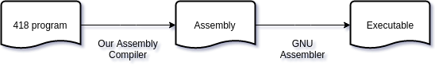
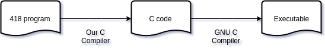
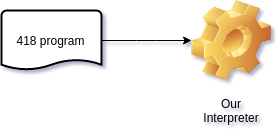

# **418**: A small "procedural" language

## Table of content
 
 - [Intro](#intro-)
 - [Requirement](#requirement-)
 - [Modes](#modes-)
 	- [Assembly compiler](#assembly-compiler-)
 	- [C Compiler](#c-compiler-)
 	- [Interpreter](#interpreter-)
 - [Usage](#usage-)
 	- [Example](#example-)
 - [Tutorial on 418](#tutorial-on-418-)
 	- [Comment](#comment-)
 	- [Declaring a variable](#declaring-a-variable-)
    - [Assigning value to a variable](#assigning-value-to-a-variable-)
 	- [Arithmetic operations](#arithmetic-operations-)
 	- [Reading from the keyboard](#reading-from-the-keyboard-)
 	- [Writing to the screen](#writing-to-the-screen-)
 	- [Requirement](#requirement-)
 	- [Decision making](#decision-making-)
	- [Iterative statement](#iterative-statement-)
 	- [More examples](#more-examples-)

    
## Intro [↑](#table-of-content)
`418` is a simple procedural programming language which can be used to teach underages how to code. 
It's simplistic syntax is easy to learn.

This repo contain the languages compiler/interpreter with some tutorials and sample codes.

## Requirement [↑](#table-of-content)
The compiler/interpreter is built using `python 3` and uses `gcc` as a back end compiler.

- Python >= 3.4
- GCC >= 4.8
- Make

## Modes [↑](#table-of-content)
The compiler/interpreter has three operating modes.

 1. Assembly compiler (default)
 2. C Compiler
 3. Interpreter
    
### Assembly compiler [↑](#table-of-content)
In this mode the compiler read a 418 program and compiles it to x64 linux assembly code.
The compiled assembly code is in AT&T syntax.



> This is not portable but make it efficient small executable since it doesn't link or load libc or another library/runtime beside ours.

If you want to view the intermediate assembly code pass `-s` flag when compiling the file.

Assembly compiler mode is the **default** mode and you don't need to pass any thing to switch to this mode except `-o` for the output executable

```bash
python3 src/Main.py sample/swap_variables.418 -o swap -s
```

#### Notice:
The default compiler(Assembly compiler) have a library in the `libs/` directory.
Please build the lib before using the Assembly compiler.

```
cd libs/ && make && cd ..
```

## C Compiler [↑](#table-of-content)
In this mode the compiler read a 418 program and transpile it to a c source code.



> This is portable and should be used if we need a windows executable

If you want to view the intermediate c code pass `-c` flag when compiling the file.

To switch to C Compiler you need to pass `-c` and `-o` for the output executable

```bash
python3 src/Main.py sample/swap_variables.418 -o swap -c
```

## Interpreter [↑](#table-of-content)
In this mode the compiler read a 418 program and execute it line by line.



```bash
python3 src/Main.py sample/swap_variables.418 -e
```

## Usage [↑](#table-of-content)
```
usage: Main.py [-h] (-e | -o OUTPUT) [-s | -c] file

Our '418' language compiler/interpreter

positional arguments:
  file                  The .418 program source code

optional arguments:
  -h, --help            show this help message and exit
  -e, --execute         interpret the given program
  -o OUTPUT, --output OUTPUT
                        the output executable of the file
  -s, --asm             compile to asm
  -c, --c               transpile to c

```

### Example [↑](#table-of-content)

#### Compile and run (using assembly compiler)
```bash
python3 src/Main.py sample/hello_world.418 -o hello
./hello
```

#### Compile and run (using c compiler)
```bash
python3 src/Main.py sample/calculator.418 -o calc -c
./calc
```

#### Interpret [↑](#table-of-content)
```bash
python3 src/Main.py sample/factoria.418 -e
```

## Tutorial on 418 [↑](#table-of-content)

### Comment [↑](#table-of-content)
Comments are used to make the programs user
friendly and easy to understand. The good thing about comments is that they
are completely ignored by compilers and interpreters. So you can use whatever
language you want to write your comments.

A line is a comment if it start with the hashtag `#` symbol.

```c
####################
# This is a comment
# በአማኛም መሆን ይችላል
####################
```

### Declaring a variable [↑](#table-of-content)

Variables are the names you give to computer memory locations which are used
to store values in a computer program.

Writing the keyword var followed by an identifier is variable declaration.

```javascript
var first_number
var second_number
var yet_another_number
```

##### Notice:
 - all variables can only holds integer
 - all variables will be initialized by `0`.
 - their must be at least one space b/n the var keyword and the identifier
 - the identifier name must be an alpha numeric sequence with an underscore
 - the identifier name shouldn't start with a number
 - the identifier name shouldn't be a keyword

##### 418 Programming Reserved Keywords

| Keywords |
| -------- |
| do       |
| elif     |
| else     |
| end      | 
| if       |
| read     |
| var      |
| while    |
| write    |
| writeln  |

We can also initialize when we declare variable

```javascript
var first_number = 21
var second_number = -43
var yet_another_number = first_number
```

### Assigning value to a variable [↑](#table-of-content)

You can assign a value (other variable or a number literal) to the variable like this

```javascript
first_number = 35
second_number = -1
yet_another_number = second_number
```

### Arthimatic oprations [↑](#table-of-content)
418 programming language provides various arithmetic operators. The
following table lists down a all of the arithmetic operators available in
418 programming language. 

Assume variable A holds `10` and variable B holds `20`,
then:

| Operator | Description                                 | Example             |
| -------- | ------------------------------------------- | ------------------  |
| +        | Adds two operands                           | A + B will give 30  |
| -        | Subtracts second operand from the first     | A - B will give -10 |
| *        | Multiplies both operands                    | A * B will give 200 |
| /        | Divides numerator by de-numerator           | B / A will give 2   |
| %        | This gives remainder of an integer division | B % A will give 0   |

```javascript
add = 45 + 23
sub = variable - 4
mul = variable * other_variable
div = other_variable / 2
mod = variable % variable
```
##### Notice:
 - the / is an integer division. means 5/2 is 2 not 2.5
 - the operand can be a variable or a number

### Reading from the keyboard [↑](#table-of-content)
To make our program productive we need to interact with the user.

You can read from the standard input like this.
The program will wait for an input.

```javascript
var x

read x
```

### Writing to the screen [↑](#table-of-content)
Our program is useless if it doesn't present any result

You can write to the standard output like this.

```javascript
var x = 21

write "The value of x is: "
write x

writeln "This will add a line feed at the end" 
```
Notice:

 - We can write a variable, a number literal or string literal.
 - We can use `writeln` to add a line feed at the end of the output 

```c
# this are equvalent
write "This two lines are equivalent.\n"
writeln "This two lines are equivalent."
```

### Decision making [↑](#table-of-content)

Decision making is critical to computer programming. There will be many
situations when you will be given two or more options and you will have to select
an option based on the given conditions. 

For example, we want to write a remark about a student based on his secured marks. 

Following is the situation:

	Assume given marks are x for a student:
 	
    If given marks are more than 95, then
  	Student is brilliant
 	
    If given marks are less than 30, then
  	Student is poor
  	
    If given marks are less than 95 and more than 30, then
    Student is average

| Conditional Operator | Description              | Example               |
| -------------------- | ------------------------ | --------------------- |
| > 				   | Greater than 			| 45 > 13 is `true`		|
| >=     			   | Greater than or equal to | 13 >= 13 is `true`	|
| <					   | Less than 				| 45 < 13 is `false`	|
| <= 				   | Less than or equal to 	| 14 <= 13 is `false`	|
| ~					   | Equal to 				| 13 ~ 13 is `true`		|
| !					   | Not equal to 			| 13 ! 13 is `false`	|


We can program that using 
#### if conditional statements

```javascript
var x = 45;

if x >= 95 do
	write "Student is brilliant\n"
end

if x < 30 do
	writeln "Student is poor"
end

if x < 95 do
	if x > 30 do
    	writeln "Student is average"
    end
end
```
#### if...else statement
An if statement can be followed by an optional else statement, which executes
when the Boolean expression is false. 

The syntax of an if...else statement in 418 programming language is:
```c
if(boolean_expression) do
	# Statement(s) will execute if the above Boolean expression is true
elif(boolean_expression) do
	# Statement(s) will execute if the above Boolean expression is true
else do
	# Statement(s) will execute if all the Boolean expression are false
end

```

```javascript
var x = 25;

if x >= 95 do
	write "Student is brilliant\n"
elif x < 30 do
	writeln "Student is poor"
else do
	writeln "Student is average"
end
```
#### Example: Comparing three numbers

```javascript
var x
var y
var z

write "X: "
read x

write "Y: "
read y

write "Z: "
read z

if x > y do
	if x > z do
		writeln "X is large"
	elif x < z do
		writeln "Z is large"
    else do
    	writeln "X and Z are large"
    end
elif x < y do
	if y > z do
		writeln "Y is large"
	elif y < z do
		writeln "Z is large"
    else do
    	writeln "Y and Z are large"
    end
else do
	if x > z do
		writeln "X and Y are large"
	elif x < z do
		writeln "Z is large"
    else do
    	writeln "X, Y and Z are large"
    end
end
```

### Itrative statements [↑](#table-of-content)
Almost all the programming languages provide a concept called loop, which helps in executing one or more statements up to a desired number of times. All high-level programming languages provide various forms of loops, which can be used to execute one or more statements repeatedly.

If we want to write "I'm a Teapot" hundred time we can and should use loop as follow.

```javascript
var times = 100

while times > 0 do
    writeln "I'm a Teapot"
    times = times - 1
end
```

#### Example: Calculate the factorial of a number

```javascript
var num

write "Enter a number: "
read num

var fact = 1

while num > 1 do
    fact = fact * num
    num = num - 1
end

write "The factorial: "
writeln fact
```
