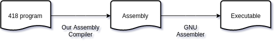
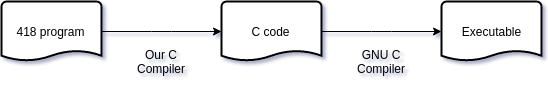
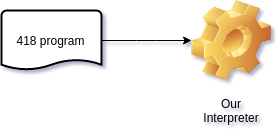

# *Q[3.02]* **418**: A small procedural language

## Intro
`418` is a simple procedural programming language which can be used to teach underages how to code. 
It's simplistic syntax is easy to learn. Please check the `docs/` folder for a tutorial.
This repo contain the languages compiler/interpreter with some tutorials and sample codes.

## Requirement
The compiler/interpreter is built using `python 3` and uses `gcc` as a back end compiler.

- Python >= 3.4
- GCC >= 4.8
- Make

## Modes
The compiler/interpreter has three oprating modes.

    1. Assembly compiler (default)
    2. C Compiler
    3. Interpreter
    
### Assembly compiler
In this mode the compiler read a 418 program and compiles it to x64 linux assembly code.
The compiled assembly code is in AT&T syntax.



> This is not portable but make it efficient small executable since it doesn't link or load libc or another library/runtime beside ours.

If you want to view the intermediate assembly code pass `-s` flag when compiling the file.

Assembly compiler mode is the **default** mode and you don't need to pass any thing to switch to this mode except `-o` for the output executable

```bash
python3 src/Main.py sample/swap_variables.418 -o swap -s
```

#### Notice:
The default compiler(Assembly compiler) have a library in the `libs/` directory.
Please build the lib before using the Assembly compiler.

```
cd libs/ && make && cd ..
```

## C Compiler
In this mode the compiler read a 418 program and transpile it to a c source code.



> This is portable and should be used if we need a windows executable

If you want to view the intermediate c code pass `-c` flag when compiling the file.

To switch to C Compiler you need to pass `-c` and `-o` for the output executable

```bash
python3 src/Main.py sample/swap_variables.418 -o swap -c
```

## Interpreter
In this mode the compiler read a 418 program and execute it line by line.



```bash
python3 src/Main.py sample/swap_variables.418 -e
```

## Usage
```
usage: Main.py [-h] (-e | -o OUTPUT) [-s | -c] file

Our '418' language compiler/interpreter

positional arguments:
  file                  The .418 program source code

optional arguments:
  -h, --help            show this help message and exit
  -e, --execute         interpret the given program
  -o OUTPUT, --output OUTPUT
                        the output executable of the file
  -s, --asm             compile to asm
  -c, --c               transpile to c

```

## More example

### Compile and run (using assembly compiler)
```bash
python3 src/Main.py sample/hello_world.418 -o hello
./hello
```

### Compile and run (using c compiler)
```bash
python3 src/Main.py sample/calculator.418 -o calc -c
./calc
```

### Interpret 
```bash
python3 src/Main.py sample/factoria.418 -e
```